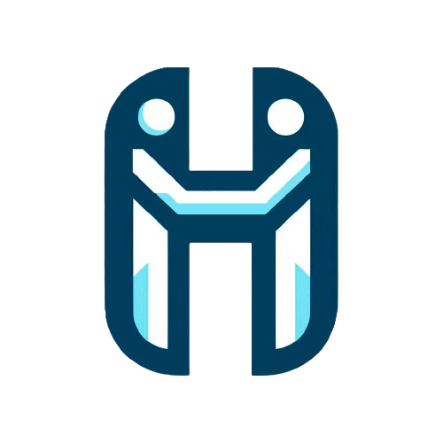

# Humanity

Nuestra aplicación, Humanity, es una aplicación móvil que conecta usuarios con proveedores de servicios en el Área metropolitana del Valle de Aburrá, permitiendo buscar, comparar y contratar profesionales de manera rápida y segura.

  

## Herramientas:

Este proyecto fue desarrollado a través de las siguientes herramientas:

- [Android Studio](https://developer.android.com/studio?hl=es-419)
- [Flutter](https://flutter.dev)
- [Dart](https://dart.dev)
  
## Contacto

Camilo Alvarez Muñoz: camilo.alvarezm@udea.edu.co

Juan Camilo Arteaga Ibarra: camilo.arteaga1@udea.edu.co
